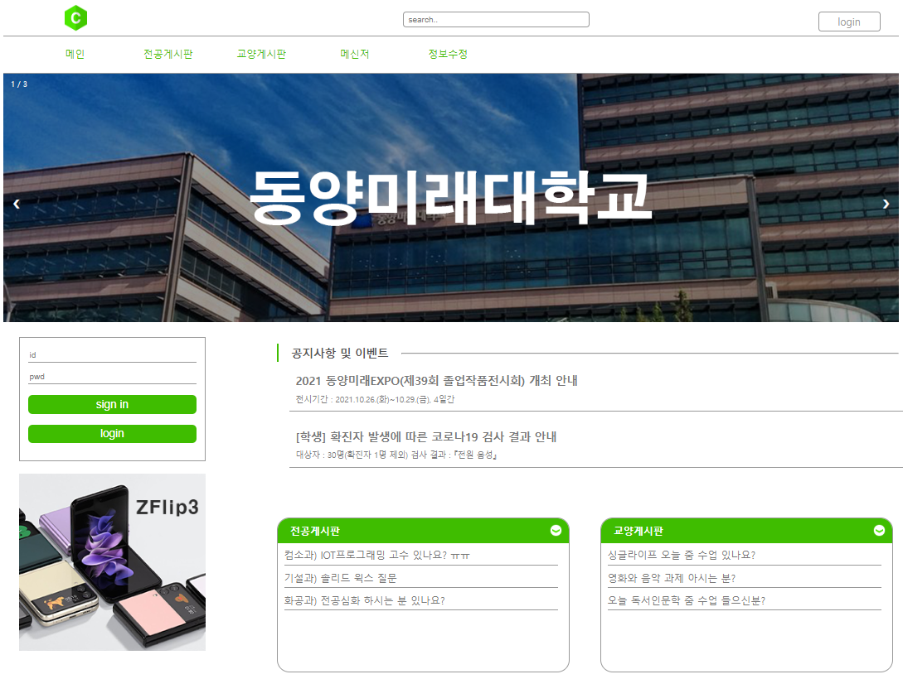
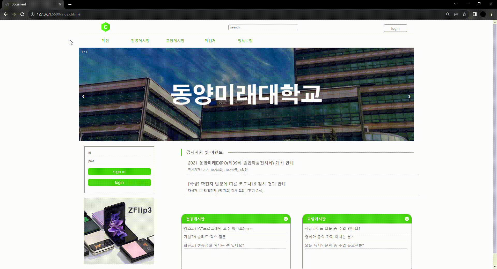

## 대학교 페이지 제작
### 프로젝트 개요
> 개발 스택 : html, css  
> 프로젝트 목적 : 대학교 홈페이지로서 필수적인 기능을 추려 짧은 개발 기간 안에 완성하는 것이 목적인 프로젝트입니다.  
> 본 프로젝트는 다양한 기능을 구현하기보단 중요 기능을 구현하여 촉박한 상황 속 빠르게 개발하는 능력을 기르기 위한 프로젝트이기도 합니다.

### 전체 화면
   

### 홈페이지 세부사항
#### 슬라이드 기능

좌, 우 버튼을 통해 사용자가 원하는 공지사항을 볼 수 있도록 구현하였으며, 보다 편안한 사용을 위해 애니메이션 효과를 주었습니다.   

### 반응형 사이트
#### 버튼 활성화
  

#### 하단 게시판 글의 활성화

홈페이지의 있는 버튼 및 링크에 사용자의 움직임이 감지되면 이에 반응하여 색상 변화 등을 통해 무슨 기능이 활성화 되었는지 알려줍니다.   
